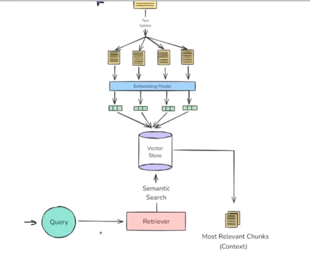
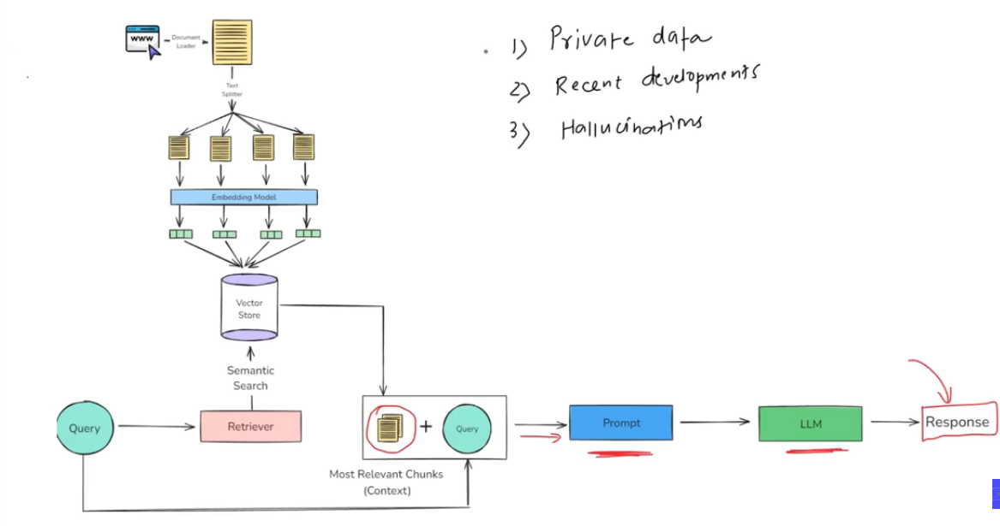

RAG:- ia a technique combines information retrivals with language generation where a model retrives relevent document from a knowledge base an dthen users them as context to generate accurate and grounded response ?
use to update info 
better privacy 
no limitt of documnt size 

Document loder :- TextLoader PyPDFLoader WebBaseLoader CSVLoader
Load vs Lazy Load 
loads everyhting at once 
return list document obj
load all document immedietly into memory 

lazy load()
load on demand 
a generator of document object 
not all loaded at once 

Text_Splitting 
larg_text to Chuncks so that LLM can understand 

it match the keyword 
is two movi similar or not rather than matching keywork we use plot 
we use embeding as a angular distance if distance is high then similarity is low 
and same vice versa 
we use vector to calculate cosine simalarity 
for evey document we need to store in vector 
and we cant store  it on mysql or oracal we can t store if we store then we can calcult/e the similarity
and computational we also be high so we need intelligent symantic search 
so we face this challange so the ans is vectore store to build this kind of problem 

system design to store and retrive representation as numerical 

key features 
store 
memory 
similarity search 
Indexing 
CRUD Operation 

use case 
sementi c search 
RAG
Recommender system 
Image/Multimedia Search 

Image ultimedia :- to search somthing it takes much time like sort search so to solve this we use indexing concept nad clustring 
we compare with centroid and given vector then we focuse on only centroid then go into deep dive after calculating the similarity with centroid .
we can perfome CRUD operation also using this 

Vector Store Vs Vector Database 
vector store :- typically refers to a lightweight library or services that focus on storing vectors and performing similarity search 

may not include many traditional database features like translations rich query language or role based access control 

ideal for prototyping sammler scale applications 
Example FAISS where you store vector and can query them by similarity but not handle persistence and scale 

Vector Database:
A full fledge database system designed to store and query vectors 
offers additional database like features 
distributed architecture for horizonal scaling 
vector databse is effectively a vector store with extra database features e.g clustring scalling security, metadata , filletring, and durability 

vectore stire in langchain 
supported Stores: Langchain integrate with multiple vector stores FAISS , PineCone , Chroma, Qdrant, Weaviate  giving you flexibility in scale, features , and development 

common interface A unicorn vectore API lets you swap out one backend FAISS for another with minimal code changes 
Chroma Vector Store :-
Chroma is lightweight open sourse database that is especily friendly for local development and small to medium scale production 

top lavel (user)Tanent ->Database (multiple collection , doc metadata embedings  ), Database

Retirevrs
data source->Retirver (Query)->document it try to find from the data which is most relevent to the data and after that it fetch  as a input it take user query and output it gives the relevent result
there are multiple retrievers 
all are runnables 
types of reterievers:
on the basis of  data Sourse  (wikipedia retievers , Vector Re, Arxiv , )
on the basis of search (MMR, Mutliquery,Compression re)

Wikipedia Retiever:- A wikipedia Retiever is a retiever that queries the wikipedia API o fetch relevent content for a given query 

more retrives we have like BM23Retriver
ParentDocumentRetriver
TimeWeightedVectorRetriver
SelfQueryRetriever
EnsembleRetriver
MultivectorRetriver
ArxivRetriver

we have coverd the Components of RAG no we move to the RAG Concept 
python.langchain.com/docs/integrations/retrievers/

WHY?
we pretrain LLM  llm store the data in parameters 
we have now llm but how can we acces the data as a user ans is by prompting 
most of the situation this works in right ways but somtime we cant get the best response 
if we use private data then we can't get the ans because this has not been traind on the private data or pretrained 
and some senerio is hallusinuation they can imagin anythoing according to theair understanding 
then give anything as a ans 

we do solution this kind of problem use FineTuning 
we want that model should have a our private data knowledge also so we use fine tuning 

student:- LLM
Engneering:- pretrain
Training in compny:- FineTuning 

FineTuning:- 
Superwised fine tuning :- we provide label dataset 

Continued Pretaind:- Unsuperwised (as feeding transcipt )
RLHF:- How to behave in real world example 

1. Collect data
2. Choose a method (full parameter, LoRa/QLoRA,parameter effect Adapter,)
3. train for a few epoch:- 
Evaluate & Safety-test

problem:-
computationaly extensive 
strong techinal experiense 
if update for more time then it's deficult to manage 

In context Learning to solve these problem 
model learn using example and all and prompt without adapting weights.
or we called it as Fewshot learning 

An emergent property :- is a behavior or ability that suddenly appers in a system when it reches a certain scale or complexity --even though it was not explictly programmed or expected from the individual components

GP# can learn (papers "Language models are few Shot Learners(173 billion para) in context learning 

RAG is a way to make a language model (like ChatGPT) Smarter by giving it extra information at the time you ask your questinos

Understanding RAG 

we do it in 4 step 
1 indexing
2 retrivals
3 Augmentation
4 Generation

the process of making External knowledge (Context) that is called Indexing 

we stunderand the Query first then we go to external knowledge then wetry to find the query clue that is called retrivals 

When we make a promt using Query and context that is called Augmentation

when this prompt reach to LLm then it use context learning that is called Generation 

Indexing:- 
Document Ungestion :- you load your source knowledge into memory 
Text Chunking:- Break larg docs into small semantically meaningful chunks 
Embeddings Generation:- Convert Each chunk into dense vector (embeddings) that captures its meaning 
Store in a vector Stor:- Store the vectors along with the original text + metadata in a vector databse  (lacal :- FAISS, Chroma , Cloud:-Pipecone,Weaviate,Qdrant)

